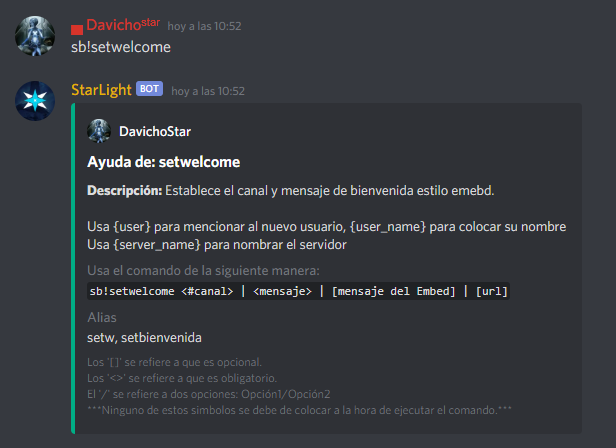

# Bienvenida

## Auto-Rol/es de Entrada

Para usarlo

## Estilo Embed

Para configurar, necesitas poner `sb!setwelcome` y te mostrará un mensaje como el siguiente:  

Entonces vamos a poner los parámetros que nos pide observa que ponemos solamente un espacio antes y después del \| que separa a cada apartado del comando. _Ten cuidado al poner el canal ya que suele dar un espacio automáticamente._  **Los últimos dos parámetros son opcionales.**

Si todo está bien veremos un embed de confirmación:  

Entonces cuando alguien entre vamos a tener esto:  

