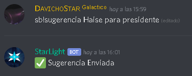

# Sugerencias

### Estableciendo el canal 

Para establece el canal en donde se enviaran las sugerencias usa el siguiente comando `sb!setsugerencias <#canal>` 

### Sugerir

 Envía una sugerencia al servidor con`sb!sugerencia <sugerencia>` 

Al mandar el comando, este se eliminará y mandará una respuesta que también será eliminado en los próximos segundos

La sugerencia se enviara al canal establecido anteriormente para que los usuarios puedan votar

### `Califica las sugerencias`

Tienes tres comandos para aprobar, denegar o indicar como sugerencia potencial:

  
Aprueba una sugerencia.  `sb!aprobar <ID> <razón>` 

Pon en potencial una sugerencia. `sb!potencial <ID> <razón>`

Rechaza una sugerencia. `sb!rechazar <ID> <razón>`


`Los votos son mostrados en el momento que fué usado algún comando de calificación de la sugerecnia, los votos posteriores a eso no serán sumados o restados a los anteriores.`


